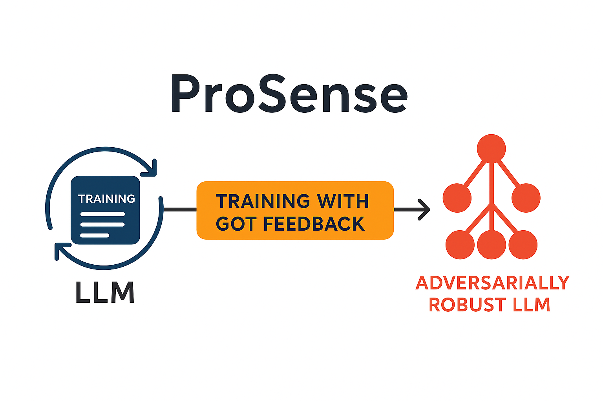

# 🧠 ProSense: Defending Text Generation with Adversarial Feedback




> A multi-stage framework to enhance LLMs' truthfulness and adversarial resilience using Graph-of-Thought reasoning and structured fine-tuning.

---

## 🚀 Overview

**ProSense** is a robust, multi-stage training framework designed to improve the truthfulness and adversarial resilience of large language models (LLMs). It leverages structured feedback in the form of Graph-of-Thought (GoT) reasoning graphs to identify and refine logical failures in model generations across curriculum-based fine-tuning cycles.

Built on a 4-bit quantized **Mistral-7B** model, ProSense incorporates adversarially generated training data and structured reasoning evaluation using **TruthfulQA**, **LLaMA**, and custom parsing logic. Training is optimized for cost-effective reproducibility on a single **A100 or H100 GPU** using **RunPod**.

---

## 🌟 Key Features

- 🔁 **Multi-Stage Fine-Tuning:** Clean, hybrid, and GoT-tagged data progressively refine model reasoning.
- ⚔️ **Adversarial Feedback Loop:** Parses and judges flawed generations to feed adversarial reasoning graphs back into training.
- 🧩 **Graph-of-Thought Parsing:** Converts flawed outputs into structured logical error paths.
- 📊 **TruthfulQA Benchmarking:** Performance evaluation using adversarial QA tasks.
- ⚙️ **GPU-Efficient Setup:** Training with 4-bit quantization on single-GPU systems.

---

## 📁 Project Structure

```plaintext
Prosense-Adversarial-Robustness/
├── Phase1_Clean_FineTuning/
│   └── phase1.ipynb
├── Phase2_Adversarial_Hybrid/
│   ├── HybridDataCreation.ipynb
│   ├── MergingWithHybridDataset.ipynb
│   └── Phase2_Final.ipynb
├── Phase3_Evaluation_Parsing/
│   ├── Phase3_1_Collect_TruthfulQA_Responses.ipynb
│   ├── Phase3_2_Judge_and_Filter_Failures.ipynb
│   ├── Phase3_3_Parse_GOT_Graph_By_LLaMA.ipynb
│   └── Phase3_Final.ipynb
└── Phase3_Level2_Refinement/
    ├── Phase4_1_Collect_Level1_Responses.ipynb
    ├── Phase4_2_Judge_Parse_Level1_By_LLaMA.ipynb
    ├── Phase4_3_Level2_Finetune.ipynb
    ├── Phase4_4_Collect_Level2_Responses.ipynb
    ├── Phase4_5_Judge_Level2_Responses.ipynb
    └── Phase4_6_Reasoning_Graph_Visualization.ipynb
```
---

Absolutely! Here is a **perfectly formatted Markdown block** for the sections you mentioned. You can **copy-paste it directly** into your `README.md` after the Project Structure section:

---

````markdown
## ⚙️ Installation

```bash
git clone https://github.com/AnuBaluguri/Prosense_Defending_Text_Generation_with_Adversarial_Feedback.git
cd Prosense_Defending_Text_Generation_with_Adversarial_Feedback
pip install -r requirements.txt
````

> Requires **Python 3.10+** and a **24GB+ GPU** (A100/H100 recommended) for full training runs.

---

## ▶️ Usage

Execute the following notebooks in order to run the full training and feedback pipeline:

### Phase 1: Clean Fine-Tuning

* `Phase1_Clean_FineTuning/phase1.ipynb`

### Phase 2: Hybrid Dataset & Adversarial Training

* `HybridDataCreation.ipynb`
* `MergingWithHybridDataset.ipynb`
* `Phase2_Final.ipynb`

### Phase 3: GoT Feedback Evaluation

* `Phase3_1_Collect_TruthfulQA_Responses.ipynb`
* `Phase3_2_Judge_and_Filter_Failures.ipynb`
* `Phase3_3_Parse_GOT_Graph_By_LLaMA.ipynb`
* `Phase3_Final.ipynb`

### Phase 4: Second-Level Reasoning Refinement

* `Phase4_1_Collect_Level1_Responses.ipynb`
* `Phase4_2_Judge_Parse_Level1_By_LLaMA.ipynb`
* `Phase4_3_Level2_Finetune.ipynb`
* `Phase4_4_Collect_Level2_Responses.ipynb`
* `Phase4_5_Judge_Level2_Responses.ipynb`
* `Phase4_6_Reasoning_Graph_Visualization.ipynb`

---

## 🧠 Advanced Features

* **Graph-of-Thought Parsing:** Converts flawed outputs into structured logical reasoning trees.
* **Curriculum Feedback Loop:** Two rounds of adversarial fine-tuning with increasing structure and depth.
* **Inference-Ready Checkpoints:** Final tuned model weights and tokenized datasets (excluded from this repo).

---

## 📈 Results


| Metric                     | Before   | After Phase 3 | Change   |
| -------------------------- | -------- | ------------- | -------- |
| **TruthfulQA Pass Rate**   | 35%      | 55%           | +20%     |
| **Adversarial Robustness** | Baseline | Improved      | **+30%** |

> *GoT visualizations highlight logical gaps, contradictions, and inference failures.*

---

## 🤝 Contributing

We welcome contributions!

To propose a fix or feature:

1. Fork the repository
2. Create a new branch
3. Submit a pull request with a clear explanation

---

## 📜 License

This project is licensed under the **MIT License**. See the `LICENSE` file for details.

---

## 🙏 Acknowledgments

* 🐍 [Unsloth](https://github.com/unslothai/unsloth) – Quantized fine-tuning tools
* 🦙 [Meta](https://ai.meta.com/research/publications/) – LLaMA 3 models
* 🤗 [Hugging Face](https://huggingface.co) – Datasets (Open-Instruct, TruthfulQA)
* ⚡ [RunPod](https://runpod.io) – GPU compute support

---
